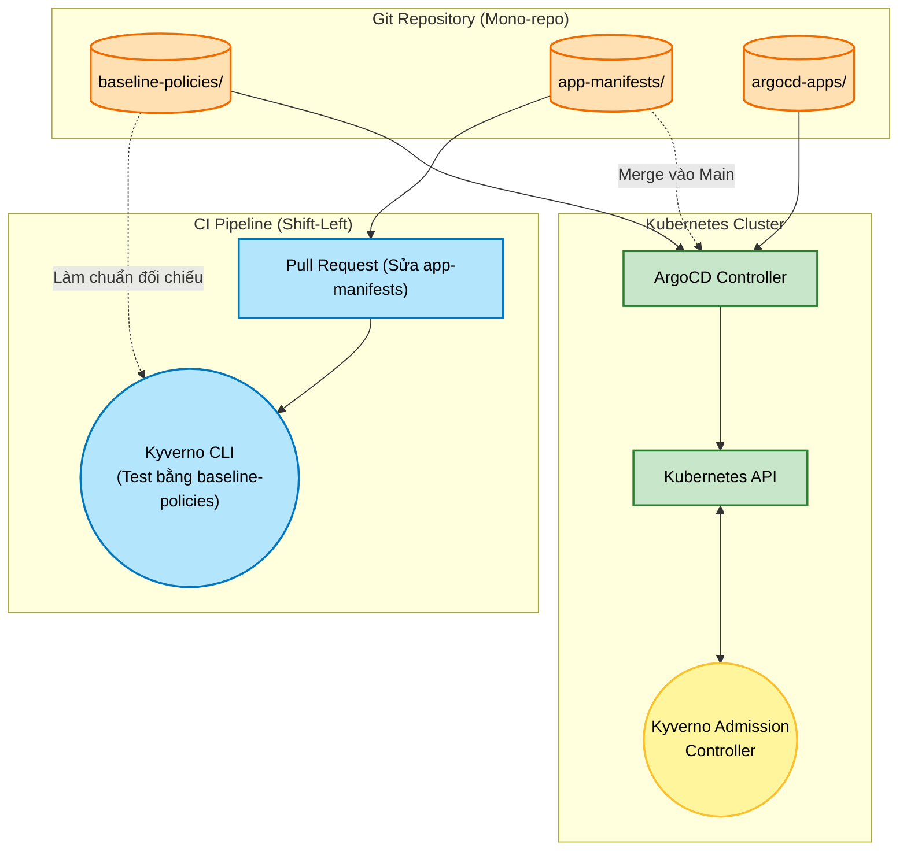

# Kyverno Project 6 – GitOps & Policy-as-Code: Tích hợp Flux/ArgoCD và Kyverno

## 📚 Lý Thuyết Nền Tảng

### Vấn đề cần giải quyết

Khi quản trị Kubernetes ở quy mô lớn (Enterprise), việc áp dụng thủ công các file YAML (bằng `kubectl apply`) trở nên thiếu an toàn, khó kiểm soát và không thể truy vết (audit).
Bên cạnh đó, nếu Developer chỉ phát hiện ra file cấu hình ứng dụng của họ vi phạm Policy (ví dụ: thiếu resource limits, dùng image lậu) ở bước cuối cùng khi triển khai lên Cluster, họ sẽ rất thất vọng vì tốn thời gian chờ đợi.

**Yêu cầu đặt ra:**
1. Mọi thay đổi về hạ tầng và ứng dụng phải được lưu trữ trên Git (Single Source of Truth).
2. Tự động hóa quá trình đồng bộ (Sync) từ Git xuống Cluster.
3. Chặn lỗi từ trứng nước (Shift-Left Security): Developer phải biết cấu hình của họ có hợp lệ không ngay khi vừa tạo Pull Request (PR).
4. Xử lý ngoại lệ an toàn: Có thể "châm chước" (Bypass) một số rule cho một vài ứng dụng đặc thù mà không làm suy yếu Policy tổng thể của hệ thống.

### Giải pháp: Kết hợp GitOps + Kyverno

Project 6 là đỉnh cao của quản trị Kubernetes hiện đại, kết hợp triết lý **GitOps** (sử dụng ArgoCD hoặc FluxCD) và **Policy-as-Code** (sử dụng Kyverno).

Trong Project này, chúng ta sẽ áp dụng các khái niệm nâng cao của Kyverno:
- **Comprehensive Policies**: Kết hợp tất cả các loại rule đã học (Validate, Mutate, Generate, Cleanup, ImageVerify) thành một bộ "Baseline Policy" tiêu chuẩn.
- **Kyverno CLI (`kyverno apply`)**: Công cụ dòng lệnh tích hợp vào CI (GitHub Actions, GitLab CI) để test manifests ngay trên Pull Request.
- **PolicyException CRD**: Tài nguyên mới giúp cấp quyền "Bypass" (ngoại lệ) một cách tinh tế và minh bạch cho các trường hợp đặc biệt, thay vì nhét hàng tá khối `exclude` làm rối rắm ClusterPolicy.

---

## 🏗️ Cấu Trúc Thư Mục Dự Án (Mono-repo)

Dự án này sử dụng mô hình GitOps theo dạng Mono-repo, bao gồm các thư mục chính:

- **`.github/workflows/`**: Chứa kịch bản CI/CD (GitHub Actions) để tự động kiểm tra (Shift-Left Testing) các file cấu hình bằng Kyverno CLI mỗi khi có Pull Request.

- **`baseline-policies/`**: Chứa toàn bộ các chuẩn mực bảo mật và vận hành (Kyverno ClusterPolicies). Đây là các rào chắn (Guardrails) của hệ thống.

- **`app-manifests/`**: Chứa các file cấu hình ứng dụng của team Dev (như Pod, Deployment, Service) và cả các ngoại lệ (như `policy-exception.yaml` và `bad-pod.yaml`).

- **`argocd-apps/`**: Chứa các khai báo `Application` của ArgoCD để tự động đồng bộ mã nguồn từ Git vào Kubernetes Cluster.

### Sơ đồ Luồng hoạt động (Workflow)



### Phân tích Kiến trúc Chi tiết:

1. **Quản lý tập trung (GitOps):** Mọi tài nguyên từ cấu hình ứng dụng, chính sách an ninh, đến khai báo cài đặt ArgoCD đều được lưu chung trong một Mono-repo. Thư mục `argocd-apps/` đóng vai trò là "mồi lửa" (bootstrap) để ArgoCD tự động theo dõi và kéo các thư mục còn lại (`baseline-policies` và `app-manifests`) vào cụm.

2. **Shift-Left Testing (Bảo vệ từ sớm):** Khi Developer sửa đổi file trong `app-manifests/` và tạo Pull Request, kịch bản GitHub Actions (từ thư mục `.github/`) sẽ được kích hoạt. Công cụ Kyverno CLI sẽ tải bộ luật chuẩn từ `baseline-policies/` và chạy test (Validation) ngay 
trên Pull Request. Nếu có lỗi cấu hình, Pull Request sẽ bị báo fail và không cho phép Merge.

3. **Continuous Deployment (Đồng bộ liên tục):** Khi Pull Request hợp lệ và được Merge vào nhánh chính (`main`), ArgoCD sẽ lập tức nhận diện sự thay đổi trên Git và đồng bộ (Sync) thay đổi đó vào Kubernetes API Server. Tính năng Self-Heal của ArgoCD sẽ đảm bảo cấu hình trên cụm luôn giống hệt Git (tự động đè lại nếu có ai sửa tay).

4. **Chốt chặn cuối cùng (Admission Control):** Ngay cả khi cấu hình đã đi qua ArgoCD để vào Cluster, Kyverno Admission Webhook (thành phần bảo vệ chạy ngầm trong cụm) vẫn sẽ rà soát lại lần cuối. Nó đối chiếu các lệnh tạo/sửa đổi với các luật ClusterPolicy đã được cài đặt, đảm bảo an toàn kép cho hệ thống.

---

## 🚀 Hướng Dẫn Triển Khai Chi Tiết

### Bước 1: Khởi tạo Cụm và Công cụ GitOps
Đảm bảo bạn đã cài đặt các thành phần cốt lõi trên Kubernetes:
- **Kyverno** (qua Helm chart)
- **ArgoCD** (qua Helm/CLI)

### Bước 2: Xây dựng Bộ "Baseline Policies"
Trong thư mục `baseline-policies/`, hệ thống đã cấu hình sẵn các luật cốt lõi:
- `require-labels.yaml` (Validate): Bắt buộc Pod phải có nhãn `app`.
- `add-default-resources.yaml` (Mutate): Tự động chèn CPU/Memory nếu thiếu.
- `auto-clone-secrets.yaml` (Generate): Tự động sao chép Secret.
- `cleanup-ephemeral.yaml` (Cleanup): Dọn dẹp các Pod rác môi trường test.
- `restrict-image-registries.yaml` (Validate): Cấm tải image ngoài `registry.awsfcaj.com`.

### Bước 3: Cấu hình CI Pipeline (Shift-Left) với Github Actions
File `.github/workflows/pr-test.yaml` chịu trách nhiệm tự động hóa việc test code.
Khi Developer sửa file trong thư mục `app-manifests/` và tạo Pull Request, Github Actions sẽ cài Kyverno CLI và chạy lệnh:
```bash
kyverno apply ./baseline-policies/ -r ./app-manifests/
```
Nếu file của Developer vi phạm luật trong `baseline-policies`, PR sẽ bị chặn lại (báo fail) ngay lập tức.

### Bước 4: Triển khai với ArgoCD
Thay vì dùng `kubectl apply` thủ công, chúng ta giao phó cho ArgoCD.
Trong thư mục `argocd-apps/` có 2 file `Application`:
1. `baseline-policies-app.yaml`: Lệnh cho ArgoCD liên tục theo dõi và đồng bộ thư mục `baseline-policies/` vào cụm.
2. `app-manifests-app.yaml`: Lệnh cho ArgoCD đồng bộ thư mục `app-manifests/` vào cụm.

Chỉ cần gõ lệnh sau 1 lần duy nhất:
```bash
kubectl apply -f argocd-apps/
```
Từ đó về sau, ArgoCD sẽ tự động đảm bảo trạng thái trên Git giống hệt trên Cluster (tự động phục hồi nếu có trôi dạt).

### Bước 5: Khởi tạo Policy Exception
Cho phép một ứng dụng cụ thể bỏ qua chính sách (Bypass).
Bên trong thư mục `app-manifests/`, bạn có file `policy-exception.yaml`:

```yaml
apiVersion: kyverno.io/v2alpha1
kind: PolicyException
metadata:
  name: bypass-image-check-for-test-app
  namespace: test-namespace
spec:
  exceptions:
  - policyName: restrict-image-registries
    ruleNames:
    - validate-registries
  match:
    any:
    - resources:
        kinds:
        - Pod
        names:
        - test-app-*
        namespaces:
        - test-namespace
```

File này sẽ được ArgoCD đồng bộ vào Cluster. Kyverno đọc được sẽ cấp "thẻ bài miễn tử" cho `test-app` để bỏ qua rule `validate-registries`.

---

## Hướng Dẫn Sử Dụng (Dành cho DevOps & Dev)

- **Với Developer:** Không cần truy cập trực tiếp vào Cluster. Chỉ cần tạo file YAML ứng dụng, Push lên Git và xem kết quả CI báo lỗi ở dòng nào. Tự sửa và Merge.

- **Với DevOps:** Quản lý tập trung mọi Policy trên Git. Nếu team Dev xin "ngoại lệ", DevOps sẽ tạo một file `PolicyException` đẩy lên Git. Khi test xong, chỉ cần xóa file đó trên Git, hệ thống sẽ trở lại bảo mật 100%.

---

## 🧪 Các Kịch Bản Kiểm Thử (Test Cases)

### Test Case 1: Shift-Left CI (Chặn lỗi ngay trên PR)

**Mục tiêu:** Kiểm chứng Kyverno CLI phát hiện lỗi thiếu `resources` trên máy Dev hoặc CI.

1. File `app-manifests/bad-pod.yaml` cố tình cấu hình thiếu label và xài sai image.
2. Khi CI chạy lệnh:

```bash
kyverno apply ./baseline-policies/ -r ./app-manifests/bad-pod.yaml
```

**Kết quả mong đợi:** Lệnh trả về mã lỗi (Exit code > 0) kèm thông báo rõ ràng "Thiếu label app" và "Unknown image registry", ngăn chặn việc Merge code.

### Test Case 2: GitOps Sync & Admission Block

**Mục tiêu:** Cố tình đưa file lỗi vào Cluster bằng ArgoCD/Flux và xem Kyverno chặn đứng.

1. Tắt CI (Bypass CI) và ép Merge đoạn code lỗi (file `bad-pod.yaml`) vào nhánh `main`.

2. Theo dõi giao diện ArgoCD tiến hành Sync thư mục `app-manifests/`.

**Kết quả mong đợi:** ArgoCD báo trạng thái `Sync Failed` cho `bad-pod`. Khi xem chi tiết (Events), sẽ thấy thông báo từ Kyverno Webhook: `admission webhook "validate.kyverno.svc" denied the request...`

### Test Case 3: Châm chước tinh tế với PolicyException

**Mục tiêu:** Cho phép `test-app` tải image từ DockerHub dù ClusterPolicy mặc định chỉ cho phép `registry.awsfcaj.com`.

1. Nhờ có file `app-manifests/policy-exception.yaml` đã khai báo trước đó.
2. Khi file `app-manifests/test-app.yaml` được ArgoCD triển khai (có dùng `nginx:latest`).
**Kết quả mong đợi:** Pod `test-app-1` được tạo thành công! Trong khi đó, nếu một Pod khác (`hacker-app`) thử dùng `nginx:latest`, nó vẫn sẽ bị chặn ngặt nghèo.

---

## ⚠️ Lưu Ý Khi Triển Khai Production

1. **Bật tính năng PolicyException:**
   Tính năng `PolicyException` yêu cầu cài đặt Helm chart: `enablePolicyException: true` (hoặc `enablePolicyException` cho container args) trong Kyverno.

2. **Kỷ luật GitOps:**
   Khi đã dùng GitOps, **TUYỆT ĐỐI KHÔNG** được dùng lệnh `kubectl edit clusterpolicy` trực tiếp trên Cluster. Kyverno và ArgoCD sẽ "đánh nhau" (ArgoCD sẽ tự động đè lại thay đổi của bạn để duy trì chuẩn trên Git do tính năng Self-Heal).

3. **Phân quyền Repo:**
   Thư mục `baseline-policies/` và `argocd-apps/` phải được bảo vệ nghiêm ngặt. Chỉ có DevOps lead hoặc Security team mới có quyền Approve (duyệt PR) cho các thay đổi trong thư mục này.